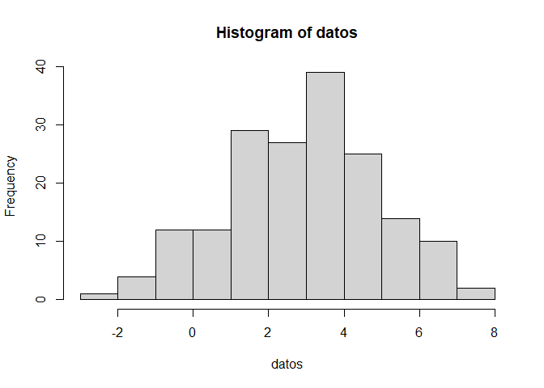
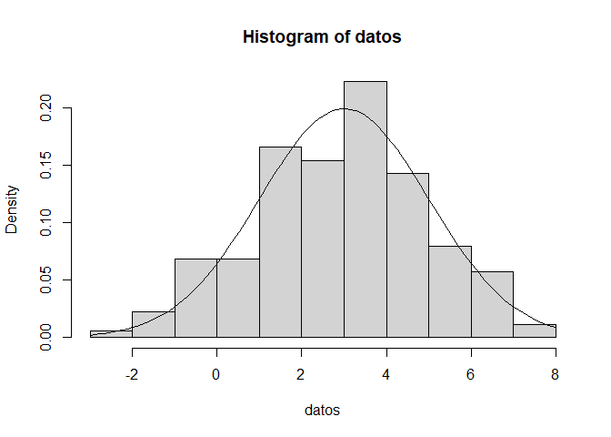
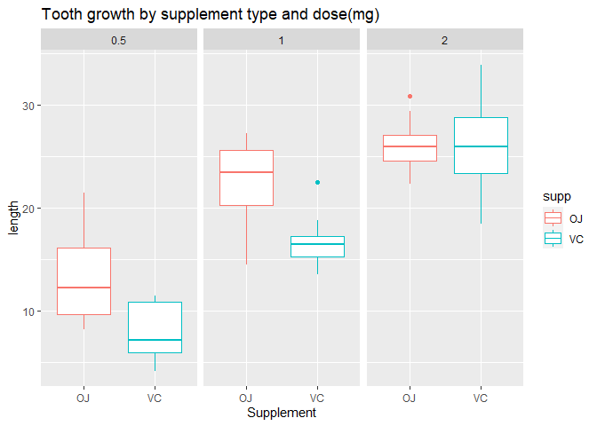

## Synopsis

##### This report is part of Statistical Inference course from Johns Hopkins University (Coursera).

### It consists of two parts:

 1. A simulation exercise.

    * will compare the exponential distribution in R with the Central Limit Theorem.

 2. Basic inferential data analysis.

    * I will analyze (very basically) the ToothGrowth data in the R datasets package.


### Part 1 : Simulation exercise with exponentials

##### Generate 175 random values from a normal distribution of mean 3 and standard deviation 2 (uses seed 113) 

```r
options(width=80)
set.seed(113) 
datos<-rnorm(175,3,2)
head(datos)
```

```
## [1]  3.2667090  5.7504432  4.4974301  0.4122990  1.8824584 -0.4648985
```
##### Now let's see two important data such as the mean and variance of the data 

```r
mean(datos)
```

```
## [1] 2.892319
```

```r
var(datos)
```

```
## [1] 4.042107
```
##### Now let's see the histogram reflecting the distribution of the information 

```r
 hist(datos)
```

<!-- -->

##### Relative frequencies are represented and it is possible to make a comparison with the theoretical density function. This comparison is done by executing the following code below. 

```r
 hist(datos, freq=FALSE)
 curve(dnorm(x,3,2),add=TRUE)
```

<!-- -->

##### From the above we can see how the sample data are distributed against the density they show, so we see the central limit theorem. 

### Part 2 : Basic inferential data analysis with ToothGrowth dataset


#### ToothGrowth: The Effect of Vitamin C on Tooth Growth in Guinea Pigs

##### Description

###### The response is the length of odontoblasts (cells responsible for tooth growth) in 60 guinea pigs. Each animal received one of three dose
###### levels of vitamin C (0.5, 1, and 2 mg/day) by one of two delivery methods, orange juice or ascorbic acid (a form of vitamin C and coded as VC).


#### Mission

0. Load library's

1. Load the ToothGrowth data and perform some basic exploratory data analyses

2. Provide a basic summary of the data.

3. Use confidence intervals and/or hypothesis tests to compare tooth growth by Supplement and Dose. 

4. State your conclusions and the assumptions needed for your conclusions.


##### Load library's


```r
library(data.table)
library(datasets)
library(ggplot2)
```


#### Load the ToothGrowth data and perform some basic exploratory data analyses


```r
# The Effect of Vitamin C on Tooth Growth in Guinea Pigs
data(ToothGrowth)
toothGrowth <- data.table(ToothGrowth) 
setnames(toothGrowth, c('len','supp','dose'),c('Length','Supplement','Dose'))
toothGrowth$Dose <- as.factor(toothGrowth$Dose)
```
##### As we see, there are 60 observations with 3 variables in this data. Here is a brief explanation of the variables: len denotes the length of the growth, supp represents the delivery (supplement) type (either VC or OJ), and dose denotes the dose in milligrams/day. We change the names of the variables to Length, Supplement, and Dose, respectively.


### Basic Summary of the data


```r
summary(toothGrowth)
```

```
##      Length      Supplement  Dose   
##  Min.   : 4.20   OJ:30      0.5:20  
##  1st Qu.:13.07   VC:30      1  :20  
##  Median :19.25              2  :20  
##  Mean   :18.81                      
##  3rd Qu.:25.27                      
##  Max.   :33.90
```

```r
head(toothGrowth)
```

```
##    Length Supplement Dose
## 1:    4.2         VC  0.5
## 2:   11.5         VC  0.5
## 3:    7.3         VC  0.5
## 4:    5.8         VC  0.5
## 5:    6.4         VC  0.5
## 6:   10.0         VC  0.5
```


```r
g<-ggplot(ToothGrowth, aes(x=supp, y=len, color=supp)) + geom_boxplot() + facet_grid(facets = ~ dose) + labs(title="Tooth growth by supplement type and dose(mg)" , y = "length", x = "Supplement")
g
```

<!-- -->


```r
# Orange juice as delivery method of Vitamin C
oj <- subset(ToothGrowth, supp == "OJ")
# Ascorbic acid as delivery method of Vitamin C
vc <- subset(ToothGrowth, supp == "VC")
head(oj)
```

```
##     len supp dose
## 31 15.2   OJ  0.5
## 32 21.5   OJ  0.5
## 33 17.6   OJ  0.5
## 34  9.7   OJ  0.5
## 35 14.5   OJ  0.5
## 36 10.0   OJ  0.5
```

```r
head(vc)
```

```
##    len supp dose
## 1  4.2   VC  0.5
## 2 11.5   VC  0.5
## 3  7.3   VC  0.5
## 4  5.8   VC  0.5
## 5  6.4   VC  0.5
## 6 10.0   VC  0.5
```
##### We want to see if delivering vitamin C via orange juice enhances more tooth growth in guinea pigs than ascorbic acid. A one-sided hypothesis test will be conducted. Since we are not told whether the variances are equal or not, we will assume unequal variances to be on the conservative side. We will use the default, 95% confidence level.


```r
t.test(oj$len, vc$len, alternative = "greater", var.equal = FALSE)
```

```
## 
## 	Welch Two Sample t-test
## 
## data:  oj$len and vc$len
## t = 1.9153, df = 55.309, p-value = 0.03032
## alternative hypothesis: true difference in means is greater than 0
## 95 percent confidence interval:
##  0.4682687       Inf
## sample estimates:
## mean of x mean of y 
##  20.66333  16.96333
```

##### The result shows a t-statistic of 1.9153 with 55.3 degrees of freedom. The P-value is 0.03. The 95% confidence interval is (0.47, inf). From the result, delivery using orange juice seems to be statistically better than delivery via ascorbic acid for tooth growth in guinea pigs.

##### If you switch variables, use alternative = “less”.


```r
t.test(vc$len, oj$len, alternative = "less", var.equal = FALSE)
```

```
## 
## 	Welch Two Sample t-test
## 
## data:  vc$len and oj$len
## t = -1.9153, df = 55.309, p-value = 0.03032
## alternative hypothesis: true difference in means is less than 0
## 95 percent confidence interval:
##        -Inf -0.4682687
## sample estimates:
## mean of x mean of y 
##  16.96333  20.66333
```
##### Both one-sided hypothesis show the same P-value and degrees of freedom. The t-statistic is negative of the other and the confidence interval goes in the other direction.


#### Comparisons of dose

##### Comparison of dose 0.5 and 1, 0.5 vs 2, and 1 vs 2 with t. test (I assume data are normally distributed)


```r
dose5<-subset(ToothGrowth, ToothGrowth$dose == 0.5)
dose1<-subset(ToothGrowth, ToothGrowth$dose == 1)
dose2<-subset(ToothGrowth, ToothGrowth$dose == 2)

head(dose5)
```

```
##    len supp dose
## 1  4.2   VC  0.5
## 2 11.5   VC  0.5
## 3  7.3   VC  0.5
## 4  5.8   VC  0.5
## 5  6.4   VC  0.5
## 6 10.0   VC  0.5
```

```r
head(dose1)
```

```
##     len supp dose
## 11 16.5   VC    1
## 12 16.5   VC    1
## 13 15.2   VC    1
## 14 17.3   VC    1
## 15 22.5   VC    1
## 16 17.3   VC    1
```

```r
head(dose2)
```

```
##     len supp dose
## 21 23.6   VC    2
## 22 18.5   VC    2
## 23 33.9   VC    2
## 24 25.5   VC    2
## 25 26.4   VC    2
## 26 32.5   VC    2
```


```r
##### dose 0.5 vs 1
t.test(dose5$len,dose1$len, var.equal = T, paired = F)
```

```
## 
## 	Two Sample t-test
## 
## data:  dose5$len and dose1$len
## t = -6.4766, df = 38, p-value = 1.266e-07
## alternative hypothesis: true difference in means is not equal to 0
## 95 percent confidence interval:
##  -11.983748  -6.276252
## sample estimates:
## mean of x mean of y 
##    10.605    19.735
```


```r
##### dose 0.5 vs 2 
t.test(dose5$len,dose2$len, var.equal = F, paired = F)
```

```
## 
## 	Welch Two Sample t-test
## 
## data:  dose5$len and dose2$len
## t = -11.799, df = 36.883, p-value = 4.398e-14
## alternative hypothesis: true difference in means is not equal to 0
## 95 percent confidence interval:
##  -18.15617 -12.83383
## sample estimates:
## mean of x mean of y 
##    10.605    26.100
```


```r
#####  dose 1 vs 2" 
t.test(dose1$len,dose2$len, var.equal = F, paired = F)
```

```
## 
## 	Welch Two Sample t-test
## 
## data:  dose1$len and dose2$len
## t = -4.9005, df = 37.101, p-value = 1.906e-05
## alternative hypothesis: true difference in means is not equal to 0
## 95 percent confidence interval:
##  -8.996481 -3.733519
## sample estimates:
## mean of x mean of y 
##    19.735    26.100
```
##### Here we can see that the null hypothesis has been rejected for all dose comparisons. Therefore we can conclude that dose, without regarding supplementation, has an effect on teeth growth.


#### Calculating Confidence Interval
##### To calculate the confidence interval only, append $conf.int after the t.test( ) function. There is no need to enter mu as mu is not part of the confidence interval computation. If no confidence level is specified, R defaults to 95%.


```r
# Vitamin C delivery via orange juice at 2 ml/day
oj_two <- subset(ToothGrowth, ToothGrowth$supp == "OJ" & ToothGrowth$dose == "2")
head(oj_two)
```

```
##     len supp dose
## 51 25.5   OJ    2
## 52 26.4   OJ    2
## 53 22.4   OJ    2
## 54 24.5   OJ    2
## 55 24.8   OJ    2
## 56 30.9   OJ    2
```


```r
# Vitamin C delivery via ascorbic acid at 2 ml/day
vc_two <- subset(ToothGrowth, ToothGrowth$supp == "VC" & ToothGrowth$dose == "2")
head(vc_two)
```

```
##     len supp dose
## 21 23.6   VC    2
## 22 18.5   VC    2
## 23 33.9   VC    2
## 24 25.5   VC    2
## 25 26.4   VC    2
## 26 32.5   VC    2
```


```r
# Default is 95% confidence level
t.test(oj_two$len, vc_two$len, var.equal = FALSE)$conf.int
```

```
## [1] -3.79807  3.63807
## attr(,"conf.level")
## [1] 0.95
```


```r
# To calculate 99% confidence level
t.test(oj_two$len, vc_two$len, var.equal = FALSE, conf.level = 0.99)$conf.int
```

```
## [1] -5.239603  5.079603
## attr(,"conf.level")
## [1] 0.99
```

#### Conclusions


##### The conclusion is when the dose is 0.5 or 1.0 there is a difference between the teeth growth after taking OJ and VC, while when the dose is 2.0, there is no difference between the teeth growth after taking OJ and VC. The assumption needed is we first assumed the whole population is normally distributed, then we assumed the population is normally distributed under each dose.


##### --------


